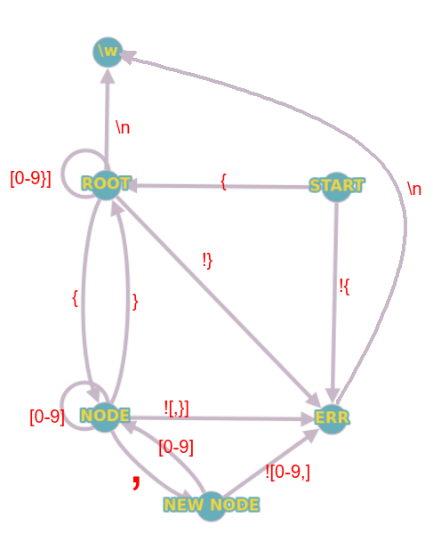

# ЛР №2

    Разработать систему приема и обработки данных о територии страны.
Каждое сообщение включает в себя площадь всей страны, площади всех входящих в нее округов.
Площадь страны должна быть равна сумме площадей вхождящих в нее округов.
Для каждого округа передается площадь всех входящих в него районов.

    Площадь округа должна быть равна сумме площадей входящих в него районов.     
Площадь - положительное число < 999. Количество округов и районов произвольное.

Пример входных данных: 500{250{125,125},250{125,125}}

# Graph

